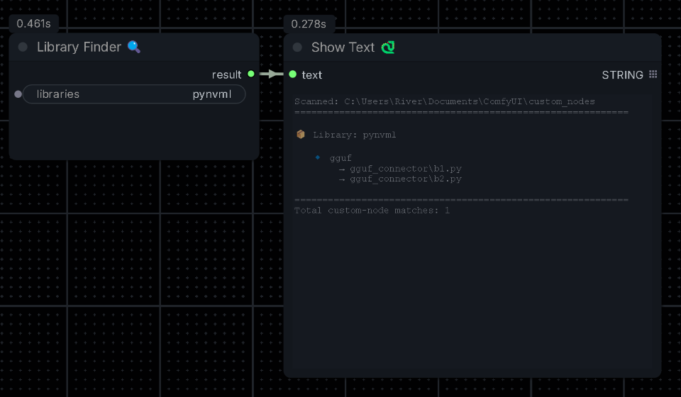
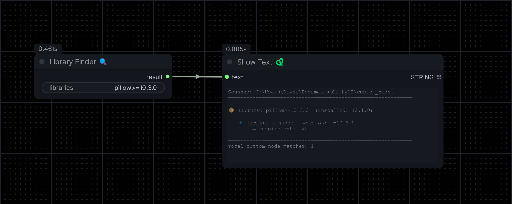

# comfyui-library-finder
This repo contains a ComfyUI custom node which helps you find which custom nodes are importing a particular python library.

# Library Finder

The Library Finder node allows as input a single python library, a python library with its version, or multiple libraries with or without versions separated by a comma. It will check through both .py and requirements.txt files in your ComfyUI/custom_nodes folder. The node provides its output as a string, so attach your favorite text display node to see the result of your search. Output contains the version installed, the list of custom nodes that require the library, and specific files within the custom nodes which mention the library. 

## Installation

### Manual
1. Clone this repo into your `ComfyUI/custom_nodes/` folder:
```bash
git clone https://github.com/RiverSide71/comfyui-library-finder.git
```

2. Restart ComfyUI

## Preview

  

 

**Known Limitations**:
  - The node depends on the requirements.txt file for specific library versions installed. It is advisable to add a comment to requiremts.txt if specific library version dependecies are discovered for a custom node.
